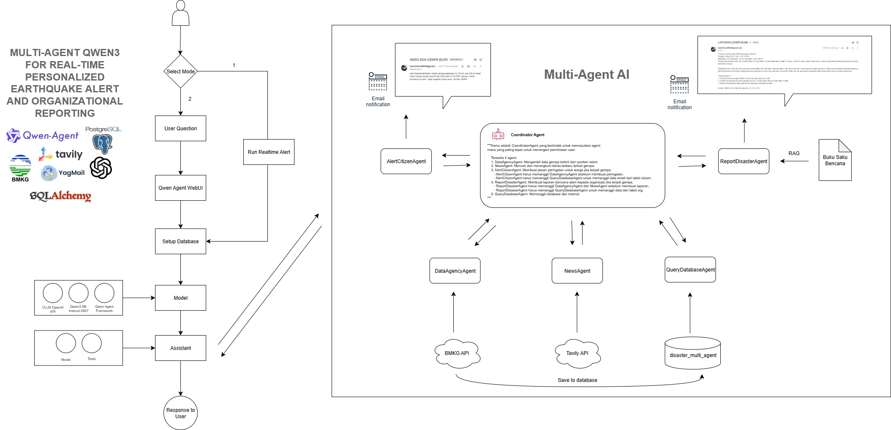

# Multi-Agent AI for Real-time Personalized Earthquake Notification for Alert and Organizational Reporting


## Overview
### Summary
Indonesia’s disaster management struggles with generic early warning communication and fragmented earthquake data spread across BMKG reports, news, and social media, making real-time aggregation and dissemination difficult. Citizens need clear, empathetic alerts, while organizations require detailed reports for coordination, but without an integrated, automated, and personalized system, responses risk being slow and ineffective. To address this, I propose Multi-Agent AI for Real-time Personalized Earthquake Notification for Alert and Organizational Reporting, which integrates diverse data sources, processes them automatically, and delivers tailored communication to different stakeholders, enabling faster and more effective disaster response. I'm using Qwen3-4B-Instruct-2507 with Qwen-Agent for multi-agent orchestration, PostgreSQL for structured data storage, and YaGmail for automated personalized notifications.

### Algorithm
1. When Python is run, the user can select the operating mode: (1) Realtime Alert or (2) Chatbot UI.
2. If the user selects (1), the system immediately runs the earthquake monitoring pipeline (fetching earthquake data, executing agents, and sending real-time earthquake notifications).
3. If the user selects (2), the user's text input will be processed through the Qwen Agent WebUI.
4. After receiving user input from (1) or (2), the system will connect to the database.
5. After connecting to the database, the model will be initialized: VLLM OpenAI API, Qwen3-4B-Instruct-2507, Qwen Agent Framework.
6. After initialization, the model will be initialized to the assistant. The assistant will call the model and tools/agents.
7. After the assistant calls, the Coordinator Agent will be executed, managing the workflow and coordinating tasks with the other agents: DataAgencyAgent, NewsAgent, QueryDatabaseAgent, AlertCitizenAgent, and ReportDisasterAgent.
8. Each agent will call its respective function, such as DatabaseAgent calling the BMKG API and saving it to the database, NewsAgent calling the TavilyAPI, and QueryDatabaseAgent calling the data in the database.
9. In AlertCitizenAgent and ReportDisasterAgent, after the message has been created by the LLM, it will be sent to their respective contacts.
10. The output from all agents will be returned to the Assistant and forwarded to the user.

## Installation

#### 1. Git Clone

```python
git clone https://github.com/bashirhanafi/multiagent_disaster.git
```

#### 2. Install requirement

```python
pip install -r requirements.txt
```

#### 3. Setup Database

Make file .env

```python
API_KEY=<api_key>
TAVILY_API_KEY=<tavily_api_key>
DB_USER="<username>"
DB_PASSWORD="<password>"
DB_HOST="<host>"
DB_PORT="<port>"
DB_NAME="disaster_multi_agent"
```

## How to use

#### 1. Open directory
```python
cd src
```

#### 2. Run the main.py
```python
python main.py
```

#### 3. Select Mode
- Mode 1 - Real-time Alert: Refresh for each 30s
- Mode 2 - Chatbot UI: Interaction with user with Qwen chatbot
```python
SELECT MODE
1. Real-time Alert
2. Chatbot UI
Select (1/2):
```


## List of Tools Used
#### Model
Qwen3-4B-Instruct-2507: A lightweight instruction-tuned language model used for reasoning and response generation.

#### List of Library
1. Qwen-Agent: Framework for building multi-agent AI systems with modular tools and task orchestration.
2. OpenAI API: Provided OpenAI API with litellm and vllm
3. PostgreSQL: A relational database for storing earthquake data, user information.
4. BMKG API: Official source for real-time earthquake and weather data in Indonesia.
5. Tavily: A retrieval tool for fetching and aggregating information from external sources like news and web.
6. YagMail: A Python package for automating personalized email notifications.
7. SQLAlchemy: A Python ORM for managing database operations with PostgreSQL efficiently.

## List of Agent
#### 1. DataAgencyAgent
- Function: Get the earthquake data from BMKG
- Input: BMKG API
- Output: BMKG earthquake response data

```python
class DataAgencyAgent(BaseTool):
    name: str = "get_data"
    description: str = "Get the earthquake data from BMKG and upsert into DB"

    def __init__(self):
        self.engine = engine
        self.reported_by = 2

    def call(self, params: dict, **kwargs):
        # implementation
```

#### 2. NewsAgent
- Function: Get news about earthquake in Indonesia
- Input: Query of "Berita Hari Ini"
- Output: List of articles
```python
class NewsAgent(BaseTool):
    name = "get_news"
    description = "Get news about earthquake in Indonesia"

    def call(self, params: str, **kwargs):
        # implementation
```

#### 3. QueryDatabaseAgent
- Function: Get the data from database
- Input: Tables query, raw query from LLM
- Output: retrieve data from query
```python
class QueryDatabaseAgent(BaseTool):
    name = "query_database"
    description = "Get the data from database"

    def call(self, params: str, **kwargs):
        # implementation
```

#### 4. AlertCitizenAgent
- Function: Give the personalized alert for citizen based on database.
- Input: DataAgencyAgent, QueryDatabaseAgent
- Output: Concise warning with clear and emphatic and email notification to user
```python
class AlertCitizenAgent(BaseTool):
    name = "alert_to_citizen"
    description = "Give the personalized alert for citizen based on database"

    def call(self, params: str, **kwargs):
        # implementation
```

#### 5. ReportDisasterAgent
- Function: Give the alert & information of earthquake impact to organization
- Input: DataAgencyAgent, QueryDatabaseAgent, "Buku Saku Panduan" Bencana document
- Output: concise report with earthquake data, impact, dan recommendation, and email notification to organization
```python
class ReportDisasterAgent(BaseTool):
    name = "report_disaster"
    description = "Give the alert & information of earthquake impact"

    # implementation
    
    def call(self, params: str, **kwargs):
        # implementation
```

## Example of Agent Capability
### 1. Greeting user
#### Request
```python
{
  "user": "Halo, apa kabar?"
}
```
#### Response
```python
{
  "response": "Halo! Semuanya baik-baik saja, terima kasih atas pertanyaannya. Apa yang bisa saya bantu hari ini? 😊"
}
```

### 2. Ask about the earthquake
#### Request
```python
{
  "user": "Apakah ada gempa?"
}
```
#### Response
```python
{
  "response": """
  Ya, terdapat gempa terkini dengan detail sebagai berikut:
  - Tanggal dan Waktu: 30 Agustus 2025 pukul 20:35:34 WIB
  - Koordinat: -4.92, 102.99
  - Magnitude: 5.0
  - Kedalaman: 21 km
  - Wilayah: Pusat gempa berada di laut, 42 km Baratdaya Kaur
  Gempa ini memiliki magnitudo 5.0, yang termasuk dalam kategori gempa yang dapat menyebabkan kerusakan ringan jika terjadi di dekat permukaan tanah. Namun, karena pusat gempa berada di laut dan kedalamannya cukup dalam (21 km), risiko dampak langsung terhadap wilayah daratan terbatas.
  
  Saya akan memeriksa apakah ada berita terkini mengenai gempa ini untuk memberikan informasi lebih lengkap."""
}
```

### 3. Ask about the news of earthquake
#### Request
```python
{
  "user": "Bagaimana berita gempa hari ini? Apakah ada kerusakan?"
}
```
#### Response
```python
{
  "response": """
  Berikut adalah beberapa berita terkini mengenai gempa di Indonesia:
  1. Gempa Terkini di Papua
  - Waktu: 25 Agustus 2025 pukul 00:22:41 WIB
  - Magnitudo: 5.0
  - Kedalaman: 15 km
  - Lokasi: 1.86 LS, 139.00 BT (Tenggara Sarmi, Papua)
  - Dirasakan: 27 km ke arah tenggara Sarmi
  - Waktu: 14 Agustus 2025 pukul 13:48:12 WIB
  - Magnitudo: 5.0
  - Kedalaman: 10 km
  - Lokasi: 1.96 LS, 139.07 BT (Tenggara Sarmi, Papua)
  - Waktu: 12 Agustus 2025 pukul 16:43:27 WIB
  - Magnitudo: 5.1
  - Kedalaman: 19 km
  - Lokasi: 1.92 LS, 139.13 BT (Tenggara Sarmi, Papua)
BMKG menginformasikan bahwa gempa-gempa ini dirasakan oleh masyarakat di sekitar wilayah tersebut dan disarankan untuk diteruskan kepada masyarakat setempat.

  2. Gempa di Jawa dan Sulawesi
    -  Pada hari ini (28 Agustus 2025), tercatat beberapa gempa kecil dengan magnitudo antara 1,8 hingga 3,4, terjadi di wilayah Jawa dan Sulawesi.
    - Contoh:
        - Pukul 19:31:22 WIB, magnitudo 3,4, kedalaman 11 km di wilayah Java.
        - Pukul 08:41:50 WIB, magnitudo 2,9, kedalaman 18 km di Jawa.

  3. Gempa Dirasakan di Sulawesi
    - Gempa dengan magnitudo 2,9 hingga 3,2 terjadi di wilayah Sulawesi, seperti di Ladongi (Kolaka Timur) dan Pendolo (Poso).
    - Gempa ini dirasakan oleh masyarakat di sekitar lokasi pusat gempa.

  4. Informasi dari BMKG
    BMKG menyediakan layanan real-time untuk memantau gempa bumi, termasuk informasi tentang gempa yang dirasakan, potensi tsunami, dan peringatan dini. Masyarakat disarankan untuk tetap waspada terhadap gempa, terutama di daerah rawan seperti Papua dan Sulawesi.

Jika Anda ingin informasi lebih lanjut atau peringatan khusus, saya bisa bantu memberikan informasi lebih mendalam.
  """
}
```


### 4. Send alert to email
#### Request
```python
{
  "user": "buatkan personalized alert dan kirim untuk organisasi ya terkait gempa"
}
```
#### Response
```python
{
  "response": """
  **Laporan Gempa untuk BNPB Kalimantan Selatan** 
    Tanggal: 30 Agu 2025 | Jam: 20:35:34 WIB 
    Gempa magnitudo 5.0, kedalaman 21 km, pusat gempa di laut 42 km baratdaya Kaur. Tidak ada data potensi tsunami. Wilayah terdampak di perairan baratdaya Kaur. 

    Berdasarkan buku saku bencana, gempa bumi merupakan peristiwa berguncang akibat tumbukan lempeng tektonik, dapat merusak infrastruktur dalam waktu singkat. Meski tidak memicu tsunami, potensi kerusakan pada struktur perairan dan infrastruktur pesisir perlu dipantau. 

    **Rekomendasi:** 
    1. Lakukan pengecekan kondisi infrastruktur pesisir dan jaringan listrik di sekitar Kaur. 
    2. Sosialisasikan siaga gempa dan evakuasi darurat kepada masyarakat. 
    3. Pantau informasi real-time dari BMKG dan siapkan tanggapan cepat jika terjadi gempa susulan. 

    Sumber: BMKG, Buku Saku Bencana (hal. 16, 22, 23)."""
}
```

## References
1. [LiteLLM API](https://litellm.bangka.productionready.xyz/) 
2. [Qwen-Agent](https://github.com/QwenLM/Qwen-Agent)
3. [SQLAlchemy Documentation](https://www.sqlalchemy.org/)
4. [BMKG API](https://data.bmkg.go.id/)
5. [Buku Saku Bencana](https://bnpb.go.id/buku/buku-saku-bencana)

